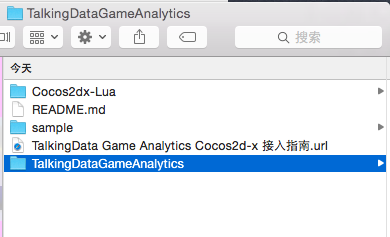
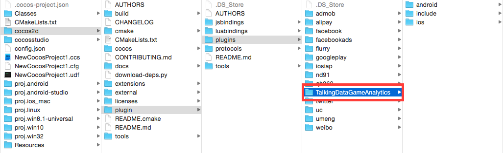
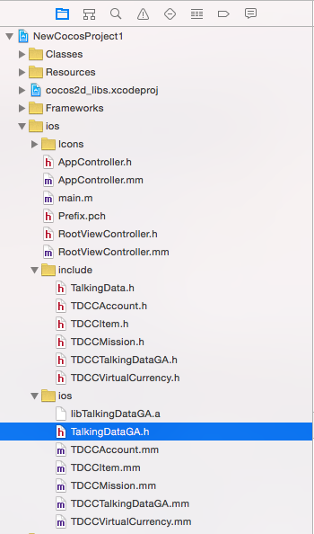
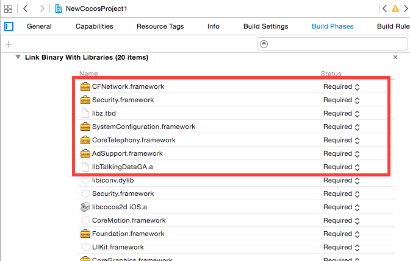
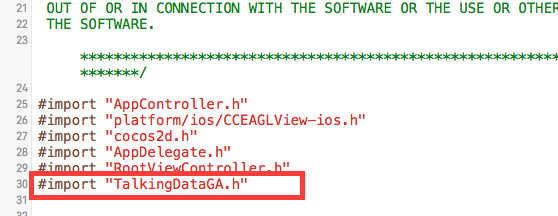
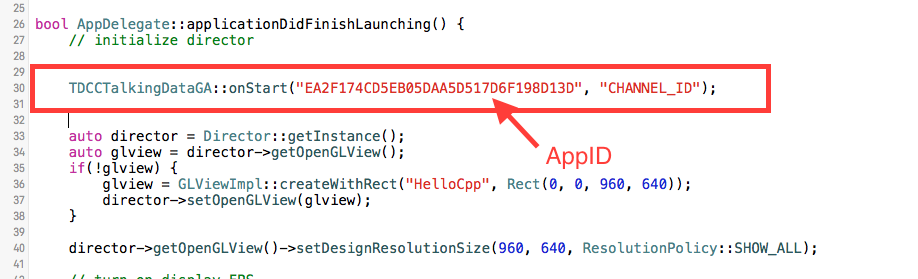
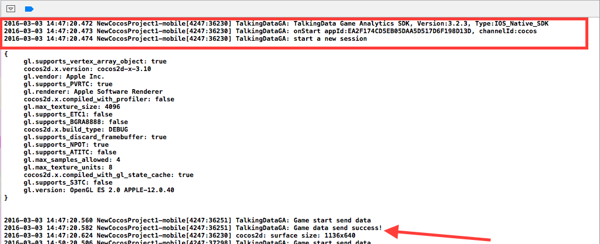

# TalkingData Game Analytics Cocos集成指南


### 目录
*   C++
	*   [公共部分](#Common)
	*   [iOS快速集成](#iOS)
		*   [添加依赖的框架](#addlib)
		*   [初始化SDK](#initSDK)
		*   [SDK API](#SDKAPI)
*   Lua

### <a name="Common"></a> 公共部分
#### <a name="Common"></a> 为游戏申请APP ID：
* 进入 [TalkingGame.com](https://www.talkingdata.com) 网站，使用您的注册账号登录后，请预先创建一款游戏，您将获得一串32位的16进制APP ID，用于唯一标识您的一款游戏。

##### 下载 [SDK Zip包](https://www.talkingdata.com/game/download/Game_Analytics_SDK_IOS_V3.2.3.zip)。
##### 导入依赖库：
* 解压缩SDK包当中的 `Game_Analytics_SDK_Cocos.zip` 文件。  

　　　　　　　　 	

* 复制整个 `TalkingDataGameAnalytics` 文件夹到 cocos2d/plugin/plugins 文件夹下。

　　　　　　　　	

### <a name="iOS"></a>iOS快速集成
##### 打开创建好的游戏工程，添加 `TalkingDataGameAnalytics` 里的 `include` 和 `ios` 到 `xcode` 项目的 `ios` 目录下
　　　　　　　　	
##### <a name="addlib"></a>添加依赖的框架
　　`TalkingData Game Analytics` 需要使用 `Security.framework` 框架辅助存储设备标识，使用 `CoreTelephony.framework` 框架获取运营商标识，使用 `AdSupport.framework` 获取 `advertisingIdentifier` ，使用 `SystemConfiguration.framework` 检测网络状况，使用 `libz.dylib` (xcode7或以后为lib.tbd)进行数据压缩，使用 `CFNetwork.framework` 做网络传输。 `Xcode` 的添加方式如下所示：    
　　
　　　　　　
##### <a name="initSDK"></a>初始化SDK
在 `AppController.mm` 文件里导入 `TalkingDataGA.h` 头文件。　


　　　　　　　　  
　　　　

在 `application:didFinishLaunchingWithOptions:` 方法初始化SDK,  `TalkingDataGA` 调用 `onStart: withChannelId:]` 方法。　
　　　　　　　　
　　　　　　　　
　　　　　　　　

在Xcode上运行，在控制台看到下面结局标识SDK初始化成功，当红色箭头 `TalkingDataGA: Game data send success` Log出现时标识数据发送成功。　　　　　　
#### <a name="SDKAPI"></a>SDK API　　　　　　
###### 统计玩家帐户:  (TDGAAccount类)
``` bash
// 返回用户对象
+ (TDGAAccount *)setAccount:(NSString *)accountId;
// 设置帐户的显性名
- (void)setAccountName:(NSString *)accountName;
// 设置帐户类型
- (void)setAccountType:(TDGAAccountType)accountType;
// 设置级别
- (void)setLevel:(int)level;
// 设置性别
- (void)setGender:(TDGAGender)gender;
// 设置年龄
- (void)setAge:(int)age;
// 设置区服
- (void)setGameServer:(NSString *)gameServer;

```
##### 跟踪玩家充值:  (TDGAVirtualCurrency)
``` bash
// 充值请求
+ (void)onChargeRequst:(NSString *)orderId
iapId:(NSString *)iapId
currencyAmount:(double)currencyAmount
currencyType:(NSString *)currencyType
virtualCurrencyAmount:(double)virtualCurrencyAmount
paymentType:(NSString *)paymentType;
// 充值成功
+ (void)onChargeSuccess:(NSString *)orderId;
// 虚拟币赠送
+ (void)onReward:(double)virtualCurrencyAmount reason:(NSString *)reason;
```

##### 任务、关卡或副本: (TDGAMission)
``` bash
// 开始一项任务
+ (void)onBegin:(NSString *)missionId;
// 完成一项任务
+ (void)onCompleted:(NSString *)missionId;
// 一项任务失败
+ (void)onFailed:(NSString *)missionId failedCause:(NSString *)cause;

```
##### 自定义事件: (TalkingDataGA)
``` bash
// 自定义事件
+ (void)onEvent:(NSString *)eventId eventData:(NSDictionary *)eventData;
```
##### 注册Notification类型
``` bash
- (BOOL)application:(UIApplication *)application didFinishLaunchingWithOptions:(NSDictionary *)launchOptions
{
[TalkingDataGA onStart:@"APP_ID" withChannelId:nil];
if ([application respondsToSelector:
@selector(isRegisteredForRemoteNotifications)]){  
// iOS 8 Notifications  
[application registerUserNotificationSettings:
[UIUserNotificationSettings
settingsForTypes:(UIUserNotificationTypeSound |
UIUserNotificationTypeAlert |
UIUserNotificationTypeBadge)
categories:nil]];
[application registerForRemoteNotifications];  
}else{  
// iOS < 8 Notifications  
[application registerForRemoteNotificationTypes:  
(UIRemoteNotificationTypeBadge |
UIRemoteNotificationTypeAlert |
UIRemoteNotificationTypeSound)];
}
// other code
}
```

**在 `application: didRegisterForRemoteNotificationsWithDeviceToken:` 方法中调用 `setDeviceToken` 传入 `DeviceToken` 。**

``` bash
- (void)application:(UIApplication *)application didRegisterForRemoteNotificationsWithDeviceToken:(NSData *)deviceToken
{
[TalkingDataGA setDeviceToken:deviceToken];
}
```             
**分别在 `application:didFinishLaunchingWithOptions:` 和 `application:didReceiveRemoteNotification:` 方法中调用 `handleTDGAPushMessage` 传入消息。**

``` bash
- (BOOL)application:(UIApplication *)application didFinishLaunchingWithOptions:(NSDictionary *)launchOptions
{
[TalkingDataGA onStart:@"APP_ID" withChannelId:nil];
if (![TalkingDataGA handleTDGAPushMessage:launchOptions]) {
// other code
}
// other code
}

- (void)application:(UIApplication *)application didReceiveRemoteNotification:(NSDictionary *)userInfo
{
if (![TalkingDataGA handleTDGAPushMessage:userInfo]) {
// other code
}
}
```
##### 注:具体SDK API 的使用请看Demo.