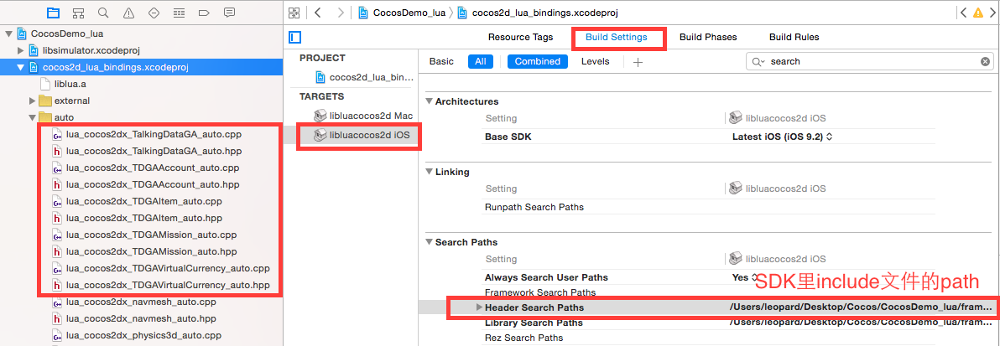

# TalkingData Game Analytics Cocos集成指南


### 目录
*   C++
	*   [为游戏申请APP ID](#Common)
	*   [iOS快速集成](#iOS)
	*   [Android快速集成](#Android)
	*   [初始化SDK](#initSDK)
	*   [SDK API](#SDKAPI)

*  Lua
	*  	[导入 SDK􏰋􏰜􏰚](#SDKImport)
	*  	[Cocos2d-x 3.x的接入方法](#Cocos2d-x3.x)
	*   [iOS路径配置](#iOSpathconfig)
	*   [SDK Lua的调用](#SDKuse)


#### <a name="Common"></a> 为游戏申请APP ID：
* 进入 [TalkingGame.com](https://www.talkingdata.com) 网站，使用您的注册账号登录后，请预先创建一款游戏，您将获得一串32位的16进制APP ID，用于唯一标识您的一款游戏。

##### 下载 [SDK Zip包](https://www.talkingdata.com/game/download/Game_Analytics_SDK_IOS_V3.2.3.zip)。
##### 导入依赖库：
* 解压缩SDK包当中的 `Game_Analytics_SDK_Cocos.zip` 文件。  

　　　　　　　　 	

* 复制整个 `TalkingDataGameAnalytics` 文件夹到 cocos2d/plugin/plugins 文件夹下。

　　　　　　　　	

### <a name="iOS"></a>iOS快速集成
##### 打开创建好的游戏工程，添加 `TalkingDataGameAnalytics` 里的 `include` 和 `ios` 到 `xcode` 项目的 `ios` 目录下
　　　　　　　　	
##### <a name="addlib"></a>添加依赖的框架
　　`TalkingData Game Analytics` 需要使用 `Security.framework` 框架辅助存储设备标识，使用 `CoreTelephony.framework` 框架获取运营商标识，使用 `AdSupport.framework` 获取 `advertisingIdentifier` ，使用 `SystemConfiguration.framework` 检测网络状况，使用 `libz.dylib` (xcode7或以后为lib.tbd)进行数据压缩，使用 `CFNetwork.framework` 做网络传输。 `Xcode` 的添加方式如下所示：    
　　
　　　　　　　　

### <a name="Android"></a>Android快速集成
##### 打开创建好的游戏工程，把 `TalkingDataGameAnalytics` 文件夹 copy 到您的工程所引用的 `cocos` 库的 `external` 目录下。
　　　　　　　　

##### 在 `Android Studio`集成
1. 在 `Android Studio` 里打开(或导入)你自己的游戏工程。
2. 把 `TalkingDataGameAnalytics/andorid/Game_Analytics_SDK_Android_xxx.jar`复制到 `libs` 
3. 修改 `jni/main.cpp` 文件.  
	* 添加头文件 `#include "TDGAJniHelper.h"`。
	* 在 `cocos2.x` 版本中在 `JNI_OnLoad()` 方法中添加
	* 
			TDGAJniHelper::setJavaVM(vm);
	* 在 `cocos3.x` 版本中在 `cocos_android_app_init()`方法中添加
	
			TDGAJniHelper::setJavaVM(JniHelper::getJavaVM());
4. 修改游戏项目中的 `jni/Android.mk`。
	* 在 `LOCAL_WHOLE_STATIC_LIBRARIES := cocos2dx_static` 后面添加

			LOCAL_WHOLE_STATIC_LIBRARIES += cocos2dx-talkingdata。
	* 在$(call import-module,.)后面添加

			$(call import-module,TalkingDataGameAnalytics/android)。
		
5. 运行 `TalkingData` 的 `Demo`。

	* 为了减小 `SDK` 包的大小,`TD` 的 `demo` 中已经把里面 `cocos2d` 文件夹删除,还需要从其它的任意 `cocos` 项目中把 `cocos2d` 整个文件夹拷贝过去

		

#### <a name="initSDK"></a>初始化SDK
##### IOS SDK 初始化
在 `AppDelegate.cpp 文件里导入 `TalkingData.h` 头文件。　


　　　　　　　　  
　　　　

在 `applicationDidFinishLaunching` 方法初始化SDK,  `TalkingDataGA` 调用 `onStart` 方法。　
　　　　　　　　
　　　　　　　　
　　　　　　　　

在Xcode上运行，在控制台看到下面结局标识SDK初始化成功，当红色箭头 `TalkingDataGA: Game data send success` Log出现时标识数据发送成功。　　　　
　　　　　　　
　　　　　　　　

##### Android SDK 初始化
###### 配置AndroidManifest.xml
- `INTERNET`	允许程序联网和发送统计数据的权限。    
* `ACCESS_NETWORK_STATE`	允许应用检测网络连接状态，在网络异常状态下避免数据发送，节省流量和电量。
* `READ_PHONE_STATE`	允许游戏以只读的方式访问手机设备的信息，通过获取的信息来定位唯一的玩家。
* `ACCESS_WIFI_STATE`	获取设备的MAC地址。
* `WRITE_EXTERNAL_STORAGE`	用于保存设备信息，以及记录日志。
* `ACCESS_FINE_LOCATION（可选）`	用来获取该游戏被使用的精确位置信息
* `ACCESS_COARSE_LOCATION（可选）`	用来获取该应用被使用的粗略位置信息。

示例代码    

	<!--?xml version="1.0" encoding="utf-8"?-->
	<manifest ......>
    	<uses-permission android:name="android.permission.INTERNET" />
      	<uses-permission android:name="android.permission.ACCESS_NETWORK_STATE" />
      	<uses-permission android:name="android.permission.READ_PHONE_STATE"  />
      	<uses-permission android:name="android.permission.ACCESS_WIFI_STATE"  />
		<uses-permission android:name="android.permission.WRITE_EXTERNAL_STORAGE"  />
		<uses-permission android:name="android.permission.ACCESS_FINE_LOCATION"  />
	  	<uses-permission android:name="android.permission.ACCESS_COARSE_LOCATION"  />
 
      <application ......>
          <activity ......>
              ......
              </activity>
      </application>
	</manifest>

在应用程序的 `Application` 类的 `onCreate ` 方法中调用 `TalkingDataGA.init`    
_注：无 `Application ` 类请自行添加_  

	public class MainApplication extends Application{
	    @Override 
	    public void onCreate() {
	    	super.onCreate();
			TalkingDataGA.init(this, "您的 App ID", "渠道 ID");
   	 	}
	}  
成功调用此方法会输出调用日志，例如：

	03-07 14:11:52.643 8719-8719/org.cocos2dx.TalkingDataDemo I/TDGA: TalkingData Game Analytics Android_Native_SDK SDK Init: 
							SDK version is3.2.3
							App ID is :DEE6B9F5187FE0CB38009B6AC50A7DBC
							Channel is :TalkingData
	03-07 14:11:52.814 8719-8719/org.cocos2dx.TalkingDataDemo I/TDGA: TalkingDataGA.init()# TDGA Initialized Completed.     
`SDK` 初始化成功后调能看到数据上报日志，例如：  

	03-07 14:11:57.089 8719-8764/org.cocos2dx.TalkingDataDemo I/TDGA: Send data to server.
	03-07 14:11:57.189 8719-8764/org.cocos2dx.TalkingDataDemo I/TDGA: Send success : true  
附注：    
1. App ID: 在TalkingData Game Analytics创建应用后会得到App ID。 
		  
2. 渠道 ID: 是渠道标识符，可通过不同渠道单独追踪数据。   
#### <a name="SDKAPI"></a>SDK API　　　　　　
###### 统计玩家帐户:  (TDGAAccount类)
``` bash
// 返回用户对象
static TDCCAccount* setAccount(const char* accountId);
// 设置帐户的显性名
void setAccountName(const char* accountName);
// 设置帐户类型
void setAccountType(TDCCAccountType accountType);
// 设置级别
void setLevel(int level);
// 设置性别
void setGender(TDCCGender gender);
// 设置年龄
void setAge(int age);
// 设置区服
void setGameServer(const char* gameServer);

```
##### 跟踪玩家充值:  (TDGAVirtualCurrency)
``` bash
// 充值请求
static void onChargeRequest(const char* orderId, const char* iapId, double currencyAmount, const char* currencyType, double virtualCurrencyAmount, const char* paymentType);
// 充值成功
static void onChargeSuccess(const char* orderId);
// 虚拟币赠送
static void onReward(double currencyAmount, const char* reason);
```

##### 任务、关卡或副本: (TDGAMission)
``` bash
// 开始一项任务
static void onBegin(const char* missionId);
// 完成一项任务
static void onCompleted(const char* missionId);
// 一项任务失败
static void onFailed(const char* missionId, const char* failedCause);

```
##### 自定义事件: (TalkingDataGA)
``` bash
// 自定义事件
static void onEvent(const char* eventId, EventParamMap* map = NULL);
```
##### 注:具体SDK API 的使用请看Demo.


### lua
#### <a name="SDKImport"></a> 导入 SDK􏰋􏰜􏰚：        
* 􏰱􏰲 􏰱􏰲 按照 `Cocos2d` 的接入指南(C++导入部分)将 `Cocos2d` 的 `SDK` 导入您的工程，并安装接入指南进行配置。   

#### <a name="Cocos2d-x3.x"></a> Cocos2d-x 3.x的接入方法
* 将 `Cocos2dx-Lua/Cocos2dx-3.x` 文件夹中的10个文件添加到您的工程中，如  `/frameworks/cocos2d-x/cocos/scripting/lua-bindings/auto` 目录下。   
* 在您工程 `/frameworks/cocos2d-x/cocos/scripting/lua-bindings/manual/`  `CCLuaStack.cpp` 文件中，添加上面的 5 个.hpp头文件。

``` bash  
#if (CC_TARGET_PLATFORM == CC_PLATFORM_IOS || CC_TARGET_PLATFORM == CC_PLATFORM_ANDROID)

#include "lua_cocos2dx_TalkingDataGA_auto.hpp"
#include "lua_cocos2dx_TDGAAccount_auto.hpp"
#include "lua_cocos2dx_TDGAMission_auto.hpp"
#include "lua_cocos2dx_TDGAVirtualCurrency_auto.hpp"
#include "lua_cocos2dx_TDGAItem_auto.hpp"
#endif

```
* 在 `CCLuaStack.cpp` 文件的init方法中调用lua注册方法。

``` bash 
#if (CC_TARGET_PLATFORM == CC_PLATFORM_IOS || CC_TARGET_PLATFORM == CC_PLATFORM_ANDROID)
register_all_cocos2dx_TalkingDataGA(_state);
register_all_cocos2dx_TDGAAccount(_state);
register_all_cocos2dx_TDGAMission(_state);
register_all_cocos2dx_TDGAVirtualCurrency(_state);
register_all_cocos2dx_TDGAItem(_state);
#endif

```
#### <a name="iOSpathconfig"></a> iOS路径配置
* 选中 `cocos2d_lua_bindings.xcodeproj` 文件，`TARGETS` 为 `libluacocos2d iOS` , 点击 `Build Settings` , 找到 `Search Paths` 下的 `Header Search Patchs` , 添加路径：`$(SRCROOT)/../../../../plugin/plugins/TalkingDataGameAnalytics/include`  


lua环境配置参考下图：

  


#### <a name="SDKuse"></a> SDK Lua的调用
以下在您的.lua 文件里调用

##### 1.	TalkingDataGA  
* TalkingDataGA:setVerboseLogDisabled()   
* TalkingDataGA:onStart(“user_app_key”, “channel_Id”)   
* local eventData = {key1="value1", key2="value2", key3="value3"}  
* TalkingDataGA:onEvent(“event1”, eventData)   
* TalkingDataGA:setLocation(39.9497, 116.4137)   
* local deviceId = TalkingDataGA:getDeviceId()   
* TalkingDataGA:onKill()   

##### 2.	TDGAAccount
``` bash
    账号类型
    kAccountAnonymous       --匿名帐户
    kAccountRegistered      --显性注册帐户
    kAccountSinaWeibo       --新浪微博
    kAccountQQ              --QQ帐户
    kAccountTencentWeibo    --腾讯微博
    kAccountND91            --91帐户
    kAccountType1           --预留1
    kAccountType2           --预留2
    kAccountType3           --预留3
    kAccountType4           --预留4
    kAccountType5           --预留5
    kAccountType6           --预留6
    kAccountType7           --预留7
    kAccountType8           --预留8
    kAccountType9           --预留9
    kAccountType10          --预留10

    性别
    kGenderUnknown = 0,      --未知
    kGenderMale = 1,          --男
    kGenderFemale = 2        --女
```

* TDGAAccount:setAccount("user001")   
* TDGAAccount:setAccountName("张三")     

* TDGAAccount:setAccountType(TDGAAccount.kAccountRegistered)
* TDGAAccount:setLevel(2)
* TDGAAccount:setGender(TDGAAccount.kGenderFemale)
* TDGAAccount:setAge(29)
* TDGAAccount:setGameServer("国服2")

##### 3TDGAMission
* TDGAMission:onBegin("新手引导")
* TDGAMission:onCompleted("新手引导")
* TDGAMission:onFailed("新手引导", "角色死亡")

##### 4.	TDGAVirtualCurrency
* TDGAVirtualCurrency:onChargeRequest("order001", "大号宝箱", 100, "CNY", 1000, "AliPay")
* TDGAVirtualCurrency:onChargeSuccess("order001")
* TDGAVirtualCurrency:onReward(5, "新手奖励")

##### 5.	TDGAItem
* TDGAItem:onPurchase("helmet1", 2, 25)
* TDGAItem:onUse("helmet1", 1)
